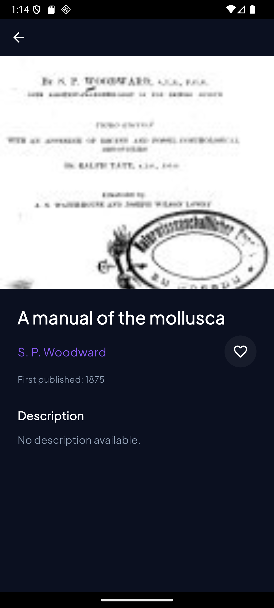
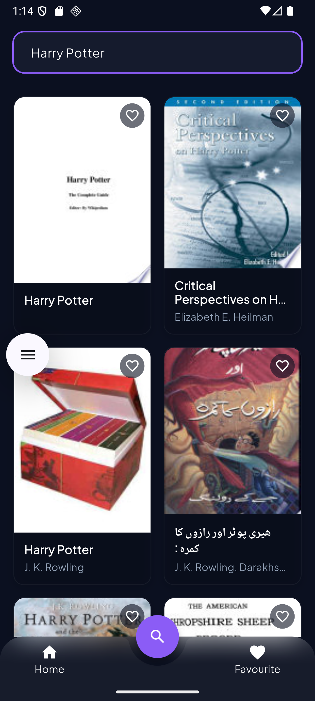
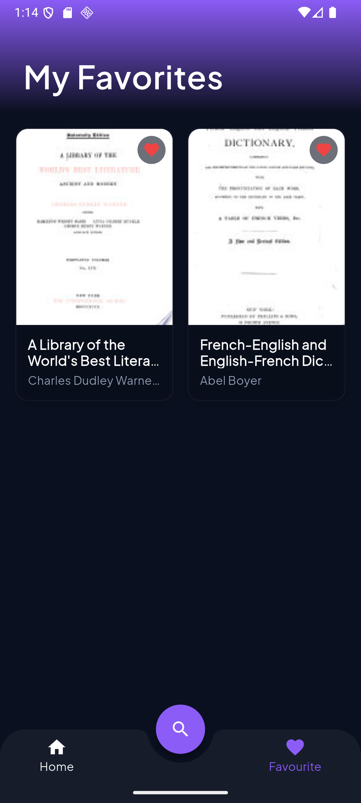

# BookBuddy

A new Flutter project showcasing a premium dark cinematic UI with animated book cards.

---

## Setup Instructions

1. **Prerequisites**
   - Install the latest stable Flutter SDK (≥ 3.19) from https://flutter.dev.
   - Ensure an Android SDK and/or iOS tooling is available for your target platform.
   - Verify the installation with `flutter doctor` – all checks should pass.
2. **Clone the Repository**
   ```bash
   git clone https://github.com/rubayet27/bookbuddy.git
   cd bookbuddy
   ```
3. **Install Dependencies**
   ```bash
   flutter pub get
   ```
4. **Run the App**
   ```bash
   flutter run
   ```
   - For a specific device, add `-d <device-id>`.
   - To enable hot‑reload, keep the terminal open and press `r` after changes.
5. **Formatting & Linting**
   ```bash
   flutter format .
   flutter analyze
   ```

---

## Flavor Setup Explanation

This project uses a simple flavor-based configuration system to support multiple environments.

Currently implemented flavors:

- Dev
- Prod

Each flavor can use different configurations such as:
- Base URL
- API Keys

The active flavor is selected from `main.dart` before app initialization.

Example:

```dart
FlavorConfig.appFlavor = Flavor.dev;
```

To run the app with a different flavor, modify `main.dart` and rebuild.

---

## State Management Approach

BookBuddy uses **flutter_bloc** for predictable, testable state management:
- **Blocs** (`HomeBloc`, `FavoritesBloc`, `SearchBloc`, etc.) encapsulate business logic and expose immutable `State` objects.
- UI widgets subscribe via `BlocBuilder`/`BlocConsumer` and react to state changes.
- Events (`FetchBooksEvent`, `ToggleFavoriteEvent`, …) drive state transitions.

This approach offers clear separation of concerns, easy unit‑testing, and scales well as the app grows.

---


## Screenshots


<p align="center">
  
  
</p>

<p align="center">
  
  
</p>


---


## Additional Resources

- [flutter_bloc Package](https://pub.dev/packages/flutter_bloc)
- [Google Fonts (used for typography)](https://pub.dev/packages/google_fonts)
